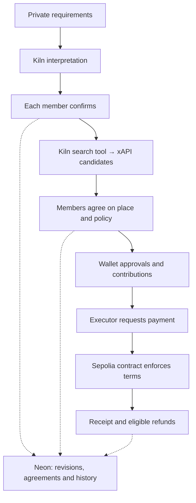

# Converge

### AI proposes. Humans approve. Smart contracts enforce.

Six friends want dinner together. Their budgets differ, some preferences are private, and someone still has to collect the money. Converge helps them agree on one plan—and gives an agent permission to pay exactly what they approved.

> **Selected function:** Converge is a multi-user purchasing agent and programmable wallet that converts private group preferences into a jointly approved purchase and allows an AI agent to execute it only within smart-contract-enforced spending conditions.

[Try the demo](https://converge-iota-seven.vercel.app/demo) · [Plan with friends](https://converge-iota-seven.vercel.app/discover) · [Inspect the evidence](https://converge-iota-seven.vercel.app/evidence) · [Run locally](#how-to-run)

**GWDC 2026 · Track A** &nbsp;|&nbsp; **Kiln `qwen3-32b` · Ethereum Sepolia** &nbsp;|&nbsp; [Built during the event](#pre-built-vs-hackathon-built-work)

## 30-Second Pitch

**The problem.** Choosing a place, agreeing on costs and pooling money are parts of the same group decision. Personal requirements get lost in chat, plans change, and one person ends up coordinating everything.

**The solution.** Each friend privately submits requirements and confirms Kiln's interpretation. Converge searches for places, collects agreement on one candidate and freezes a shared spending policy. After every member approves and contributes, an executor requests the permitted deposit payment. The contract enforces the terms and makes unused funds claimable.

**The key idea.** Group consent becomes part of payment authorization. An AI recommendation can become an action only after everyone approves its terms; a changed plan requires renewed agreement.

> **Demo scope:** real Kiln calls, real place listings and testnet transactions; **MockUSDC, a demo payment recipient and simulated booking confirmation**. Venue availability and USDC acceptance are assumed for the hackathon. Converge does not currently book a real venue or transfer real USDC.

## What to Look For

| Judging criterion | What Converge demonstrates | Where to verify |
| --- | --- | --- |
| **Technical · 30** | Kiln interpretation and search-tool calls; contract-enforced payments and refunds; recovery without duplicate payment. | [Architecture](#architecture) · [Kiln usage](#kiln-integration-and-measured-usage) · [Execution evidence](#per-flow-on-chain-proof-and-kiln-logs) |
| **Task fit · 25** | Private requirements lead to a jointly approved policy and a bounded deposit payment. | [User flow](#how-it-works) · [Verification scope](#verification-and-evidence) |
| **Innovation · 20** | The agent coordinates interpretation, search and execution around versioned group agreement and a fixed spending authority. | [AI, code and contract responsibilities](#what-the-agent-does) · [Changed conditions](#when-conditions-change) |
| **Usability · 15** | A shared planning workflow for friends, plus a guided demo that one reviewer can try. | [Live demo](https://converge-iota-seven.vercel.app/demo) · [Friends planning](docs/LIVE_GROUP_PLANS.md) |
| **Presentation · 10** | A running app, an explorable evidence page and per-flow receipts linked to Kiln records. | [Public evidence](https://converge-iota-seven.vercel.app/evidence) · [Submission status](#submission-status) |

## Try the Demo

[**Open Explore Demo →**](https://converge-iota-seven.vercel.app/demo)

The guided flow uses **one human reviewer and five disclosed automated participants**. Bring a Sepolia browser wallet; the deployment may request an event access code. The app supplies missing test funds within a bounded session.

1. **Find a place.** Enter English restaurant requirements around Gangnam Station and choose a returned candidate.
2. **Review the terms.** Select a demo deposit of 1–60 MockUSDC, review unknown venue conditions and acknowledge the demo assumptions.
3. **Approve your share.** Freeze the policy, prepare test funds, approve the allowance and contribute 10 MockUSDC. The automated participants contribute after you.
4. **Follow the payment.** Observe the permitted transaction and its receipt, followed by the simulator's reservation confirmation.
5. **Recover the remainder.** Claim your share of unused funds. Completed, cancelled or expired rounds can be followed by a new round from the same wallet.

Chain confirmations take time. Previous rounds and refund actions remain accessible. [Demo setup, limits and recovery](docs/EXPLORE_DEMO.md).

**Review without connecting a wallet:** open the [public evidence page](https://converge-iota-seven.vercel.app/evidence) or inspect the [recorded runs below](#per-flow-on-chain-proof-and-kiln-logs).

## How It Works

The [friends flow](https://converge-iota-seven.vercel.app/discover) supports **2–100 members** planning a restaurant visit, stay, space booking, sports activity or class.

| Step | What people do | What Converge does |
| --- | --- | --- |
| **1. Gather** | Create a group, set outing details and invite friends. | Saves the group before its first search, or starts a plan from a saved search. |
| **2. Understand** | Privately submit requirements, then correct or confirm the interpretation. | Kiln extracts each member's requirements; the app tracks the confirmed revisions. |
| **3. Agree** | Review candidates and unanimously choose the same place. | Searches through xAPI using confirmed group requirements; preserves source links and unknown conditions. |
| **4. Authorize** | Review the shared policy and independently approve and contribute through wallets. | Freezes the participants, recipient, exact deposit, spending limits and expiry. |
| **5. Execute** | Inspect the receipt and claim eligible refunds. | The executor requests payment; the contract enforces the policy and accounts for the remainder. |

Each friend contributes 10 MockUSDC and needs Sepolia gas. Automated funding belongs to the guided demo. [Friends workflow details](docs/LIVE_GROUP_PLANS.md).

### When Conditions Change

| Change | Result |
| --- | --- |
| A preference, membership or search result changes | Earlier place agreements become invalid. Members must agree on the current result version. |
| A mandatory conflict remains unresolved | The workflow blocks progress. Missing venue facts remain marked unknown. |
| The approved recipient or financial terms need to change | A new decision and fresh approvals are required. A locked policy cannot be edited. |
| A participant cancels before payment, or an unpaid policy expires | Eligible contributions can be recovered under that decision's contract rules. |

**Recorded budget adaptation:** six people contribute 60 MockUSDC in total. The baseline fixture run selects Restaurant A and pays 45. In a fresh run, one person reduces their meal budget from $35 to $25; the system selects B, pays 36 and makes 4 refundable to each participant. Both runs include fresh Kiln interpretations, approvals and receipts.

**Track A refusal:** the fixture decision engine has `NO_MATCH` coverage and blocks policy creation for an unmet goal. A recorded live refusal still needs to be added. The excluded-merchant run below finds a valid alternative and therefore demonstrates adaptation, not refusal.

## What the Agent Does

| Layer | Responsibility |
| --- | --- |
| **Kiln `qwen3-32b`** | Interprets private requirements, combines confirmed requirements for group search, proposes validated `search_places` tool calls and explains sanitized fixture recommendations. |
| **Application code** | Validates outputs, enforces access and revision rules, tracks unanimous agreement, freezes policy inputs and coordinates execution. The earlier fixture flow uses deterministic filtering and scoring. |
| **Smart contracts** | Hold contributions, require every member's approval and funding, enforce the immutable payment terms, allow one permitted payment and make eligible refunds claimable. |

People choose the place and authorize spending. The model never signs for participants. The contract checks the executor's actual authority before moving tokens.

## Architecture



The Next.js app handles member interaction and server-side provider calls. Neon persists revisions, agreement and execution state. A background processor submits permitted transactions and reconciles receipts. Payment authority resides in the contract; an application database update cannot change an approved policy.

<details>
<summary>Implementation map</summary>

| Component | Source |
| --- | --- |
| Kiln validation and usage recording | [Kiln client](src/lib/kiln/client.ts) |
| Search-tool validation and xAPI calls | [Discovery adapter](src/lib/discovery/xapi.ts) |
| Friends planning and agreement | [Live plans](src/lib/db/live-plans.ts) |
| Execution and recovery | [Group execution](src/lib/group-execution.ts) |
| Policy enforcement and refunds | [v1 wallet](contracts/src/ConvergeGroupWallet.sol) · [v2 wallet](contracts/src/ConvergeGroupWalletV2.sol) |

</details>

## Verification and Evidence

**Three earlier ordinary-group runs completed the full Kiln → approval → Sepolia payment → refund lifecycle.** Their 45 lifecycle receipts were verified as canonical and finalized. Across those runs, 180 MockUSDC was contributed, 117 paid and 63 refunded. Each record uses synthetic preferences and six distinct keys controlled by one test operator.

The newer friends flow also passed live-provider and payment integration checks, performed separately. The table identifies the coverage of each record.

| Flow | Verified in the recorded check | Environment and boundary |
| --- | --- | --- |
| **Friends planning** | Two authenticated identities: join, live interpretation, confirmation, five real search candidates, unanimous agreement and matching saved policies. | Production-built local HTTP server, live Kiln/xAPI and an isolated database; no Sepolia payments in this run. [Record](docs/LIVE_GROUP_PLANS.md#recorded-verification--2026-09-30) |
| **Friends payments** | Generated v2 policy, contributions, payment, refunds, broadcast recovery, cancellation and expiry. | Disposable Anvil chain, separately from the provider run. [Verification](docs/LIVE_GROUP_PLANS.md#verification) |
| **Earlier ordinary groups** | Baseline and two changed-condition runs, each through payment and six refunds. | Live Kiln and Sepolia; one operator controlled six keys. [Acceptance record](docs/GROUP_ACCEPTANCE.md) |
| **Guided live-place demo** | Payment, simulated confirmation, refunds, cancellation, expiry and repeated rounds. | Local Anvil rehearsals with fixture search responses; earlier real search and legacy Sepolia evidence are separate. [Verification](docs/LIVE_DEMO_BOOKING.md#verification) |

The September 30 friends record reports 151 application tests, TypeScript/format checks, a production build, database privacy/stale-result checks and browser inspection of the two-member policy screen. These are dated results. A continuous latest-flow walkthrough with two independently operated browser wallets through live search and Sepolia refunds is not established by those records.

### Per-Flow On-chain Proof and Kiln Logs

The following runs use the earlier synthetic restaurant catalog. Every linked JSON includes confirmed inputs, Kiln API attempts, usage, policy, transaction receipts/logs and application history.

| Flow and changed condition | Observed outcome | Inspect the proof |
| --- | --- | --- |
| **Baseline:** six $35-per-person meal budgets with a quietness preference | A; 45 MockUSDC paid; 2.5 refunded per member | [Payment transaction](https://sepolia.etherscan.io/tx/0xd24fa24c9a0d84c514330abca00b28ee186e833fddee92e5ef63a4baf7d9a7fd) · [Kiln and chain logs](docs/evidence/group-acceptance-001-baseline.json) |
| **Lower budget:** first member changes $35 → $25 | B; 36 MockUSDC paid; 4 refunded per member | [Payment transaction](https://sepolia.etherscan.io/tx/0x3f6a846511de38ad8fabb3486e0fddb032c57ecc0d19d9ddda8692cd462a58a4) · [Kiln and chain logs](docs/evidence/group-acceptance-001-lower-budget.json) |
| **Merchant excluded:** restore $35 and exclude A | B; 36 MockUSDC paid; 4 refunded per member | [Payment transaction](https://sepolia.etherscan.io/tx/0x08914573a043f0c9ecca3c22624dd80af928cb06beab881cf372e0cee1d1cbfb) · [Kiln and chain logs](docs/evidence/group-acceptance-001-merchant-excluded.json) |

<details>
<summary>Full payment transaction hashes — Ethereum Sepolia</summary>

```text
Baseline:
0xd24fa24c9a0d84c514330abca00b28ee186e833fddee92e5ef63a4baf7d9a7fd
Lower budget:
0x3f6a846511de38ad8fabb3486e0fddb032c57ecc0d19d9ddda8692cd462a58a4
Merchant excluded:
0x08914573a043f0c9ecca3c22624dd80af928cb06beab881cf372e0cee1d1cbfb
```

</details>

**Spending controls:** an 80 MockUSDC request was rejected in the first two runs; a payment to A under B's policy was rejected in the third. These were read-only `eth_call` rejections, not mined failed transactions.

**Recovery:** lost-broadcast and database-confirmation failures recovered across separate processes, retaining the original payment hash without duplicate payment. [Recovery checks](docs/GROUP_ACCEPTANCE.md#recovery-and-privacy-checks).

**Refusal coverage:** [decision tests](tests/decision-engine.test.ts) cover `NO_MATCH`; [policy tests](tests/group-policy.test.ts) block no-match or unresolved input from creating a payable policy. These tests do not substitute for the required live refusal recording.

## Kiln Integration and Measured Usage

Converge calls **Kiln `qwen3-32b` server-side**. Adapters validate outputs, bound timeouts and repair attempts, and record provider usage. Participants confirm interpretations because schema-valid output can still misunderstand their intent.

A normal successful xAPI search uses one model call and one provider request. Ambiguity can stop search for clarification. Invalid model output has a bounded repair attempt; provider errors remain visible and never become invented places. [Integration details](docs/KILN.md).

Measured usage below covers **only the three ordinary-group acceptance runs**, including failures and retries.

| Flow | Provider attempts | Input tokens | Output tokens | Total |
| --- | ---: | ---: | ---: | ---: |
| Constraint extraction | 28 | 28,494 | 11,743 | 40,237 |
| Decision explanation | 3 | 597 | 985 | 1,582 |
| Clarification | 0 | — | — | — |
| Candidate analysis | 0 | — | — | — |

**Total: 41,819 tokens; USD 0.00479144 in provider-reported cost.** Extraction recorded 18 successful and 10 failed attempts, including nine automatic retries. One failed revision required a fresh submission and never entered a policy. All three explanations succeeded; three later requests used the application cache. [Usage evidence](docs/GROUP_ACCEPTANCE.md#recorded-run-september-29-2026).

Structured state, bounded calls, cached explanations and deterministic arithmetic limit unnecessary inference. Energy consumption and NPU execution are not independently measured or attested by these responses; token counts are not energy measurements. The selected model reflects the owner's confirmed update to the original brief, as documented in [Kiln setup](docs/KILN.md#selected-model).

## Blockchain and Privacy

The contracts bind participant membership, token, recipient, executor, exact payment, spending limits and expiry. They reject unauthorized callers, insufficient funding, wrong recipients or amounts, expired/inactive decisions and duplicate payments. Decision balances are accounted for separately.

There is no administrator withdrawal or policy-editing path. Eligible participants can claim their refunds directly through the contract if the app is unavailable. Solidity and TypeScript use matching, versioned policy hashes. [Contract behavior](docs/BLOCKCHAIN.md) · [Policy encoding](docs/POLICY_ENCODING.md).

| Contract on Ethereum Sepolia (`11155111`) | Address |
| --- | --- |
| MockUSDC | [`0x4707bde238399a27f88855a34bfb31f20b386b17`](https://sepolia.etherscan.io/address/0x4707bde238399a27f88855a34bfb31f20b386b17) |
| Group wallet v1 — six-member demo and earlier policies | [`0xd43172d5bd904b68004d69545fd01dbcfdb82a89`](https://sepolia.etherscan.io/address/0xd43172d5bd904b68004d69545fd01dbcfdb82a89) |
| Group wallet v2 — 2–100 members | [`0xe06073db9ee37801f593a040cc1f8c1f11af16bb`](https://sepolia.etherscan.io/address/0xe06073db9ee37801f593a040cc1f8c1f11af16bb) |

Deployment records: [v1](contracts/deployments/11155111.json) · [v2](contracts/deployments/11155111-v2.json). The v2 deployment record used two confirmations and did not assert finality; this is distinct from the finalized earlier lifecycle receipts.

**Privacy boundary.** Raw preferences and individual interpretations are scoped to the submitting participant and authorized server processing. Kiln and search services process requirements supplied to them. Other group members see progress, shared candidates and public plan terms. This is application-level privacy: wallet activity is public, and a small group may infer a preference from the outcome.

**Real-world boundary.** Listings do not verify venue availability, USDC acceptance, allergy safety or service delivery. Unknown facts stay labelled; on-chain payment enforcement does not verify those facts.

## How to Run

Use **Node.js 24.19.0** and **pnpm 11.19.0**. Local code checks require no wallet or API key:

```sh
git clone https://github.com/miyosep/Converge.git
cd Converge
pnpm install --frozen-lockfile
pnpm check
pnpm build
```

For connected development, create an ignored `.env.development` from [`.env.example`](.env.example):

| Capability | Configuration |
| --- | --- |
| Groups and login | Isolated Neon database; `DATABASE_URL`, direct `DATABASE_URL_UNPOOLED`, `SESSION_SECRET`, `APP_ORIGIN=http://localhost:3000`. |
| Interpretation and search | Server-only `KILN_API_KEY` and `XAPI_KEY`; `KILN_MODEL=qwen3-32b`, `RESTAURANT_SEARCH_PROVIDER=xapi`. |
| Wallet actions | Sepolia RPC, the deployed contract addresses above, a browser wallet, MockUSDC and Sepolia gas. |
| Payment execution | A running processor with test executor/signers. Follow [processor setup](docs/HYBRID_PC.md). |

The migration command expects an isolated branch named `dev-preferences` and matching `NEON_BRANCH=dev-preferences`. Apply all checked-in migrations through **`0018_group_before_search.sql`**, even where older setup notes mention `0017`:

```sh
pnpm db:migrate:dev
pnpm dev
```

Open [localhost:3000](http://localhost:3000). Use [web setup](docs/WEB_APP.md) and [friends setup](docs/LIVE_GROUP_PLANS.md) for the connected workflow. The deployed app uses Vercel plus an online PC processor; its operator keys stay on the processor and outside Git.

To verify the published Sepolia evidence independently, create an ignored `.env` containing `RPC_URL` and run:

```sh
pnpm demo:groups-verify group-acceptance-001
```

This reads existing evidence and chain records; it needs no participant keys, database or Kiln credentials and sends no payment. [Verifier details](docs/GROUP_ACCEPTANCE.md).

## Pre-built vs Hackathon-built Work

**Built before the event: none.** The project owner confirms that no project-specific code, designs, templates or assets were prepared before the event.

**Built during the event:** the Converge web interface and demo assets, private preference and agreement workflows, Kiln/xAPI integrations, group-wallet contracts, payment/refund processing, verification scripts and documentation.

**External components:** Next.js, React, viem, OpenZeppelin and other dependencies are existing third-party software, listed in `package.json` and pinned in `pnpm-lock.yaml`. Kiln, xAPI, Neon and Ethereum Sepolia provide external services and infrastructure. They are not claimed as original team work.

## Submission Status

The ≤3-minute demo video, ≤10-page deck and recorded Track A refusal run still need to be linked. Team contributions and the registered roster also require final confirmation. See the [submission checklist](docs/SUBMISSION.md) and [task register](project_guideline.md#19-self-assignment-task-register).

## Further Reading

[Demo operation](docs/EXPLORE_DEMO.md) · [Friends planning](docs/LIVE_GROUP_PLANS.md) · [Live search](docs/LIVE_RESTAURANT_SEARCH.md) · [v2 wallet](docs/GROUP_WALLET_V2.md) · [Contributing](CONTRIBUTING.md)

Historical fixture data remains in the [200-example catalog](data/demo/catalog-archive.json), with its planner at `/demo/catalog`. The [direct-contract baseline](docs/evidence/baseline-001.json) and legacy KAGAMI sessions remain evidence for their original flows.
