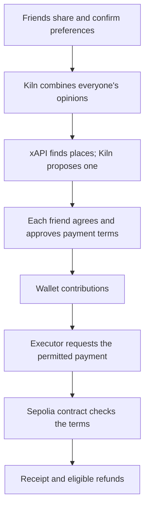

# Converge

### AI proposes. Humans approve. Smart contracts enforce.

> Converge is a multi-user purchasing agent and programmable wallet that converts private group preferences into a jointly approved purchase and allows an AI agent to execute it only within smart-contract-enforced spending conditions.

Friends want to have dinner together. One wants something affordable. Another prefers Japanese food. Someone would love a quiet place where everyone can catch up.

Finding a place is only the beginning. Everyone still needs to agree, work out the payment and trust that the plan will stay within what they approved.

**Converge helps the group get there, one shared decision at a time.**

[Try it on your own →](https://converge-iota-seven.vercel.app/demo) · [Start a plan with friends](https://converge-iota-seven.vercel.app/discover) · [View recorded runs](https://converge-iota-seven.vercel.app/evidence)

Built for **GWDC 2026 · Track A**, using **Kiln** and **Ethereum Sepolia**.

## For Judges

1. [Try Explore demo](https://converge-iota-seven.vercel.app/demo): one human plus five disclosed automated participants.
2. [Inspect paired on-chain proof and Kiln logs](#per-flow-on-chain-proof-and-kiln-logs): three recorded acceptance flows, with full hashes below.
3. [Verify the published receipts](#verify-the-submission-proof) without signing keys or new payments.
4. [Review evidence scope and code](docs/EVIDENCE_INDEX.md): historical recordings and current implementation are clearly separated.

## How It Works

### First, everyone gets a say

Start a plan and invite your friends. Each person shares their preferences privately, then reviews how the AI understood them. You can correct the interpretation before confirming it.

Converge waits for everyone. In a friends group, every participant is a real member with their own wallet.

### Then, find one place together

Once everyone has confirmed, the agent combines their opinions, searches real place listings through xAPI and proposes **one place for the group**, with a short explanation of its choice.

Different tastes call for compromise. Under the current product rule, an explicitly reported allergy in confirmed preferences stops automated group planning and new payment preparation. An explicit statement of no allergies does not block the group. Other indispensable medical/access needs remain Required; ordinary wishes and budgets are Preferred. Unknown venue facts remain unverified.

Each friend decides whether to agree with the proposal. Agreeing on dinner does not yet authorize a payment.

### Finally, approve what can be spent

After the group agrees, Converge presents the prepared payment terms: who receives the payment, the exact amount and each person's share. Everyone reviews those terms and approves their own contribution through their wallet.

Only then can the agent request payment. The smart contract checks the approved conditions before moving funds, and eligible unused funds can be claimed back.

**Today, this is a testnet experience.** Payments use a test USDC token on Sepolia and a configured test recipient. The token has no claim on real USDC, and booking confirmation is simulated. Converge does not currently reserve or pay a real restaurant.

## Try the Demo

You do not need to gather a group to try Converge.

[**Open Explore Demo →**](https://converge-iota-seven.vercel.app/demo)

You join five clearly identified automated participants, each with their own preferences. Bring a browser wallet that supports Sepolia; the app can supply missing test funds within its funding limits.

1. **Take a seat.** Start a round and share what you would like.
2. **Check your preferences.** Review the AI's interpretation before confirming.
3. **Meet the proposal.** See the place selected from all six opinions, its rationale and any facts that still need checking.
4. **Review and approve.** Inspect the exact test payment terms, then sign for your own share. Automation handles the five demo accounts.
5. **Follow the outcome.** See the transaction receipt, simulated booking result and any available refund.

Confirmations can take a little time. Your transaction history and eligible refunds remain available, and you can start another round once the current one can safely end.

Prefer to look around first? The [public evidence page](https://converge-iota-seven.vercel.app/evidence) needs no wallet. For setup and recovery details, see the [demo guide](docs/EXPLORE_DEMO.md).

### Bringing your own friends?

[Start a plan](https://converge-iota-seven.vercel.app/discover), then send the invitation to your group. Friends join on their own devices, confirm their own preferences and sign their own approvals. Groups support 2–100 members; automated participants are used only in the solo demo.

Friends collect a **30% partial reservation deposit**, derived from supported restaurant pricing or confirmed budgets—not a fixed 10 MockUSDC per person. Restaurant pricing takes precedence; otherwise use the lowest confirmed group-equivalent budget. Price ranges use a disclosed upper-bound estimate, and non-USD values use a dated exchange rate. Exact amounts, source and individual shares are shown before approval. Missing pricing/rates stop preparation. The remaining 70% is not automatically collected. Users do not enter payment amounts or recipient addresses. [Calculation details](docs/IMPLEMENTATION_STRUCTURE.md#price-basis-and-30-calculation).

[Read the friends guide →](docs/LIVE_GROUP_PLANS.md)

## When Conditions Change

Plans change. Converge needs to keep agreement and spending permission in step with them.

If someone changes a preference, membership changes or the group searches again, earlier proposal agreements are cleared. Everyone reviews the new proposal. If payment terms change, they need a new decision and fresh approvals; an already locked policy cannot be edited.

Ordinary preferences can be balanced. Reported allergies stop automated planning; other genuinely incompatible essential needs also stop the proposal. Unknown venue facts remain visible so the group can check them.

A recorded example from our earlier test catalog shows this adaptation: one friend lowers their meal budget from $35 to $25. A fresh run switches from Restaurant A to Restaurant B, reduces the group payment from 45 to 36 USDC and returns the unused contribution. The [receipts and Kiln logs](#per-flow-on-chain-proof-and-kiln-logs) are below.

## What the Agent Does

The agent connects three parts of a group decision: understanding what people mean, finding a shared option and carrying out the approved payment.

**Kiln handles the language and reasoning.** Its `qwen3-32b` model interprets preferences, combines the group's opinions and selects one proposal from the search results. People confirm their own interpretation and decide whether to accept the proposal.

**The application keeps the agreement current.** It protects private inputs, checks model responses, tracks revisions and makes sure the payment terms match the agreed plan.

**The contract enforces spending permission.** It requires the necessary approvals and contributions, permits only the authorized payment and accounts for eligible refunds. The model never signs for a real participant.

## Architecture



The Next.js app handles the shared experience and interactive provider calls. Neon stores preferences, agreements and transaction state. A background PC worker handles long-running demo jobs and payment reconciliation. Credentials and signing keys stay on the server or worker.

<details>
<summary>Explore the implementation</summary>

- [Kiln client](src/lib/kiln/client.ts): validated responses and usage recording.
- [Discovery adapter](src/lib/discovery/xapi.ts): search-tool validation and xAPI requests.
- [Friends planning](src/lib/db/live-plans.ts): private inputs, shared proposals and agreement.
- [Group execution](src/lib/group-execution.ts): payment processing and recovery.
- [Wallet v1](contracts/src/ConvergeGroupWallet.sol) and [wallet v2](contracts/src/ConvergeGroupWalletV2.sol): spending conditions and refunds.

The earlier catalog-based flow uses deterministic filtering and scoring. Its evidence below should be read separately from the current live-place selection flow.

</details>

## Verification and Evidence

You can follow a payment all the way from the confirmed inputs to its on-chain receipt.

Three earlier group runs completed the Kiln → approval → Sepolia payment → refund lifecycle. Together, they contributed **180 test USDC**, paid **117** and refunded **63**. Their 45 lifecycle receipts were checked as canonical and finalized.

These runs use a synthetic restaurant catalog and six distinct wallets controlled by one test operator. They show the payment and adaptation behavior of that recorded flow.

<details>
<summary>What the newer workflow checks establish</summary>

The September 30 [friends verification record](docs/LIVE_GROUP_PLANS.md#recorded-verification--2026-09-30) covers two authenticated test identities through live Kiln/xAPI planning and policy creation on a local production build. Payment, refund and recovery checks ran separately on a disposable Anvil chain.

The record also reports 151 application tests, TypeScript/format checks, a production build and database privacy checks. These are dated results for the version tested, including an older candidate-selection interface. They do not establish a continuous walkthrough of today's flow by two independent human browser wallets through Sepolia refunds.

The [guided demo record](docs/LIVE_DEMO_BOOKING.md#verification) covers local payment, cancellation, expiry and repeat-round rehearsals. Its real-provider and earlier Sepolia evidence are separate records.

</details>

### Per-Flow On-chain Proof and Kiln Logs

The following runs use the earlier synthetic restaurant catalog. Every linked JSON includes confirmed synthetic inputs, Kiln API attempts, usage, policy, transaction receipts/logs and application history. These historical amounts and budget eligibility rules are **not** current friends pricing rules or a recording of today's xAPI/30%/allergy flow.

**Fresh verification:** [this report](docs/evidence/submission-proof-verification.json) rechecks all three payment receipts as canonical and finalized and groups their saved Kiln call metadata by flow. Payment logs contain `Transfer`, `PaymentExecuted` and `DecisionCompleted`; the source artifacts also retain contributions/refunds.

| Flow and changed condition                                                | Observed outcome                         | Inspect the proof                                                                                                                                                                                            |
| ------------------------------------------------------------------------- | ---------------------------------------- | ------------------------------------------------------------------------------------------------------------------------------------------------------------------------------------------------------------ |
| **Baseline:** six $35-per-person meal budgets with a quietness preference | A; 45 USDC paid; 2.5 refunded per member | [Payment transaction](https://sepolia.etherscan.io/tx/0xd24fa24c9a0d84c514330abca00b28ee186e833fddee92e5ef63a4baf7d9a7fd) · [Kiln and chain logs](docs/evidence/group-acceptance-001-baseline.json)          |
| **Lower budget:** first member changes $35 → $25                          | B; 36 USDC paid; 4 refunded per member   | [Payment transaction](https://sepolia.etherscan.io/tx/0x3f6a846511de38ad8fabb3486e0fddb032c57ecc0d19d9ddda8692cd462a58a4) · [Kiln and chain logs](docs/evidence/group-acceptance-001-lower-budget.json)      |
| **Merchant excluded:** restore $35 and exclude A                          | B; 36 USDC paid; 4 refunded per member   | [Payment transaction](https://sepolia.etherscan.io/tx/0x08914573a043f0c9ecca3c22624dd80af928cb06beab881cf372e0cee1d1cbfb) · [Kiln and chain logs](docs/evidence/group-acceptance-001-merchant-excluded.json) |

### Kiln API call logs from the same flows

Open `extractionAttempts`, `explanationAttempts` and `usage` in each row's linked JSON. Logs include request IDs, model, HTTP status, timestamps, latency, token counts, cost and failed/retried attempts. Example successful HTTP 200 provider request IDs (`qwen3-32b`):

| Flow              | Extraction request ID                  | Explanation request ID                 |
| ----------------- | -------------------------------------- | -------------------------------------- |
| Baseline          | `7edd849a-d1e9-4c74-8034-51ac7e3f5c83` | `c3018f62-11e1-468e-a011-a75f204b204d` |
| Lower budget      | `6d00ab9c-82aa-4325-a69d-13141af1fd1b` | `e2fed1e3-8a8e-4358-8592-c0c48c507173` |
| Merchant excluded | `20c0f150-6a7b-4db3-9227-b4e3eece2b33` | `f384d294-19c1-43b5-92e7-9102e56ca65d` |

Example saved baseline call:

```json
{
  "flow": "constraint_extraction",
  "model": "qwen3-32b",
  "providerRequestId": "7edd849a-d1e9-4c74-8034-51ac7e3f5c83",
  "httpStatus": 200,
  "status": "success",
  "inputTokens": 1008,
  "outputTokens": 452
}
```

<details>
<summary>Full payment transaction hashes — Ethereum Sepolia</summary>

```text
Baseline:
0xd24fa24c9a0d84c514330abca00b28ee186e833fddee92e5ef63a4baf7d9a7fd
Lower budget:
0x3f6a846511de38ad8fabb3486e0fddb032c57ecc0d19d9ddda8692cd462a58a4
Merchant excluded:
0x08914573a043f0c9ecca3c22624dd80af928cb06beab881cf372e0cee1d1cbfb
```

</details>

<details>
<summary>Spending controls, retry recovery and refusal coverage</summary>

**Spending controls:** an 80 USDC request was rejected in the first two runs; a payment to A under B's policy was rejected in the third. These were read-only `eth_call` rejections, not mined failed transactions.

**Recovery:** lost-broadcast and database-confirmation failures recovered across separate processes, retaining the original payment hash without duplicate payment. [Recovery checks](docs/GROUP_ACCEPTANCE.md#recovery-and-privacy-checks).

**Refusal coverage:** [decision tests](tests/decision-engine.test.ts) cover `NO_MATCH`; [policy tests](tests/group-policy.test.ts) block no-match or unresolved input from creating a payable policy. These tests do not substitute for the required live refusal recording.

</details>

## Kiln Integration and Measured Usage

Additional evidence has a separate scope: [this earlier guided-demo payment](https://sepolia.etherscan.io/tx/0xa576cc2ac485f4ed72f81018c8aee13bcf1c41dc5bfd23752035386d6e845177) has [receipt/refund logs](docs/evidence/explore-live-e0da5b853697.json), but its `extractedFromLiveKiln` flag is not a complete API log. The [live Kiln/xAPI trace](docs/evidence/xapi-kiln-2026-09-29T15-45-16-041Z.json) records a different, off-chain run. They must not be combined into one claimed end-to-end execution. Current friends/demo/refusal code and remaining recording gaps are mapped in the [evidence index](docs/EVIDENCE_INDEX.md).

Kiln runs on the server. Converge validates its responses, limits repair attempts and records usage. When a provider call fails, the app reports the error instead of inventing a result. Participants review interpretations because even a valid response can misunderstand a person's intent.

[Read the Kiln integration guide →](docs/KILN.md)

<details>
<summary>Measured usage for the three recorded acceptance runs</summary>

Measured usage below covers **only the three ordinary-group acceptance runs**, including failures and retries.

| Flow                  | Provider attempts | Input tokens | Output tokens |  Total |
| --------------------- | ----------------: | -----------: | ------------: | -----: |
| Constraint extraction |                28 |       28,494 |        11,743 | 40,237 |
| Decision explanation  |                 3 |          597 |           985 |  1,582 |
| Clarification         |                 0 |            — |             — |      — |
| Candidate analysis    |                 0 |            — |             — |      — |

**Total: 41,819 tokens; USD 0.00479144 in provider-reported cost.** Extraction recorded 18 successful and 10 failed attempts, including nine automatic retries. One failed revision required a fresh submission and never entered a policy. All three explanations succeeded; three later requests used the application cache. [Usage evidence](docs/GROUP_ACCEPTANCE.md#recorded-run-september-29-2026).

Structured state, bounded calls, cached explanations and deterministic arithmetic limit unnecessary inference. Energy consumption and NPU execution are not independently measured or attested by these responses; token counts are not energy measurements. The selected model reflects the owner's confirmed update to the original brief, as documented in [Kiln setup](docs/KILN.md#selected-model).

</details>

## Blockchain and Privacy

The approved policy fixes the participants, recipient, payment amount, spending limits and expiry. The contract rejects requests outside those terms and prevents a second payment for the same decision. There is no administrator withdrawal or policy-editing path. Eligible refunds can also be claimed directly from the contract.

Private preferences are scoped to the submitting member and authorized server processing. Kiln and search providers process the requirements sent to them. Other members see progress, the shared proposal and public payment terms. Wallet activity remains public, and a small group may infer a preference from the result.

Place listings do not prove availability, allergy safety or acceptance of USDC. Those facts need their own confirmation; a successful blockchain transaction cannot establish them.

<details>
<summary>Sepolia contracts and deployment records</summary>

| Contract on Ethereum Sepolia (`11155111`)              | Address                                                                                                                         |
| ------------------------------------------------------ | ------------------------------------------------------------------------------------------------------------------------------- |
| USDC (test token)                                      | [`0x4707bde238399a27f88855a34bfb31f20b386b17`](https://sepolia.etherscan.io/address/0x4707bde238399a27f88855a34bfb31f20b386b17) |
| Group wallet v1 — six-member demo and earlier policies | [`0xd43172d5bd904b68004d69545fd01dbcfdb82a89`](https://sepolia.etherscan.io/address/0xd43172d5bd904b68004d69545fd01dbcfdb82a89) |
| Group wallet v2 — 2–100 members                        | [`0xe06073db9ee37801f593a040cc1f8c1f11af16bb`](https://sepolia.etherscan.io/address/0xe06073db9ee37801f593a040cc1f8c1f11af16bb) |

Deployment records: [v1](contracts/deployments/11155111.json) · [v2](contracts/deployments/11155111-v2.json). The v2 deployment record used two confirmations and did not assert finality; this is distinct from the finalized earlier lifecycle receipts.

[Contract behavior](docs/BLOCKCHAIN.md) · [Policy encoding](docs/POLICY_ENCODING.md)

</details>

## Architecture and Code Map

| Component           | Responsibility / code                                                                                                     |
| ------------------- | ------------------------------------------------------------------------------------------------------------------------- |
| Vercel web/API      | Wallet authentication, private preferences and group actions in `app/`                                                    |
| Neon Postgres       | Durable groups, revisions, agreements and policies: [live-plans.ts](src/lib/db/live-plans.ts)                             |
| Kiln + xAPI         | All confirmed opinions → internal search → one proposal: [group-preferences.ts](src/lib/discovery/group-preferences.ts)   |
| Always-on PC worker | Durable jobs, test funding, execution and reconciliation: [hybrid-worker.ts](scripts/hybrid-worker.ts)                    |
| Browser wallet      | Each real member signs separately: [GroupChainPanel](app/components/group-chain-panel.tsx)                                |
| Sepolia contracts   | Approved spending and refunds: [v1](contracts/src/ConvergeGroupWallet.sol), [v2](contracts/src/ConvergeGroupWalletV2.sol) |

The worker never signs for real friends. Users do not operate the worker. Detailed API/state/calculation decisions live in [IMPLEMENTATION_STRUCTURE.md](docs/IMPLEMENTATION_STRUCTURE.md).

## How to Run

Use **Node.js 24.19.0** and **pnpm 11.19.0**. Local code checks require no wallet or API key:

```sh
git clone https://github.com/miyosep/Converge.git
cd Converge
pnpm install --frozen-lockfile
pnpm check
pnpm build
```

For connected development, create an ignored `.env.development` from [`.env.example`](.env.example):

| Capability                | Configuration                                                                                                                 |
| ------------------------- | ----------------------------------------------------------------------------------------------------------------------------- |
| Groups and login          | Isolated Neon database; `DATABASE_URL`, direct `DATABASE_URL_UNPOOLED`, `SESSION_SECRET`, `APP_ORIGIN=http://localhost:3000`. |
| Interpretation and search | Server-only `KILN_API_KEY` and `XAPI_KEY`; `KILN_MODEL=qwen3-32b`, `RESTAURANT_SEARCH_PROVIDER=xapi`.                         |
| Wallet actions            | Sepolia RPC, the deployed contract addresses above, a browser wallet, USDC and Sepolia gas.                                   |
| Payment execution         | A running processor with test executor/signers. Follow [processor setup](docs/HYBRID_PC.md).                                  |

The migration command expects an isolated branch named `dev-preferences` and matching `NEON_BRANCH=dev-preferences`. Apply all checked-in migrations before running the current web app and processor:

```sh
pnpm db:migrate:dev
pnpm dev
```

Open [localhost:3000](http://localhost:3000). Use [web setup](docs/WEB_APP.md) and [friends setup](docs/LIVE_GROUP_PLANS.md) for the connected workflow. The deployed app uses Vercel plus an online PC processor; its operator keys stay on the processor and outside Git.

### Verify the Submission Proof

Create an ignored `.env` containing only a Sepolia `RPC_URL` and run:

```sh
node --env-file=.env --import tsx scripts/verify-submission-proof.ts
```

This checks the three published payment receipts, canonical block hashes and decoded payment events, and prints saved Kiln metadata. It does not call Kiln again, sign transactions, read private user data or overwrite artifacts.

For the existing full historical lifecycle verifier:

```sh
pnpm demo:groups-verify group-acceptance-001
```

This reads existing evidence and chain records and updates their verification fields; it needs no participant keys, database or Kiln credentials and sends no payment. [Verifier details](docs/GROUP_ACCEPTANCE.md).

## Pre-built vs Hackathon-built Work

**Built before the event: none.** The project owner confirms that no project-specific code, designs, templates or assets were prepared before the event.

**Built during the event:** the Converge web interface and demo assets, private preference and agreement workflows, Kiln/xAPI integrations, group-wallet contracts, payment/refund processing, verification scripts and documentation.

**External components:** Next.js, React, viem, OpenZeppelin and other dependencies are existing third-party software, listed in `package.json` and pinned in `pnpm-lock.yaml`. Kiln, xAPI, Neon and Ethereum Sepolia provide external services and infrastructure. They are not claimed as original team work.

## Repository Guide

- `app/`: Next.js UI and authenticated API routes.
- `src/lib/`: planning, provider adapters, persistence and payment logic.
- `contracts/`: Solidity, tests and public deployment manifests.
- `scripts/`: setup, workers, rehearsals and read-only verification.
- `tests/`: application behavior and regression checks.
- `docs/evidence/`: published records; consult the [evidence index](docs/EVIDENCE_INDEX.md) for scope.

## Further Reading

- [Product rules](docs/PRODUCT_RULES.md) — the current intended experience.
- [Friends planning](docs/LIVE_GROUP_PLANS.md) and [demo operation](docs/EXPLORE_DEMO.md) — setup, behavior and recovery.
- [Group acceptance record](docs/GROUP_ACCEPTANCE.md) — the published runs in detail.
- [Contributing](CONTRIBUTING.md) and [agent instructions](AGENTS.md) — working on the project.
