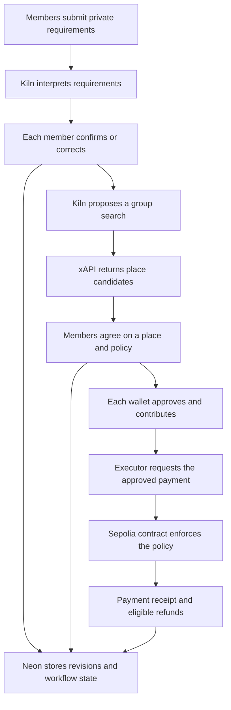

# Converge

**Converge is a multi-user purchasing agent and programmable wallet that converts private group preferences into a jointly approved purchase and allows an AI agent to execute it only within smart-contract-enforced spending conditions.**

*AI proposes. Humans approve. Smart contracts enforce.*

**Submission: Track A.** No project-specific work was built before the event; see [prior work disclosure](#pre-built-vs-hackathon-built-work).

[Live app](https://converge-iota-seven.vercel.app) · [Guided demo](https://converge-iota-seven.vercel.app/demo) · [Public evidence](https://converge-iota-seven.vercel.app/evidence) · [Run locally](#how-to-run) · [Transaction and Kiln logs](#per-flow-on-chain-proof-and-kiln-logs)

Friends privately share their requirements, Kiln helps find a place they can agree on, and each person approves a shared spending policy. An execution agent then pays only the deposit their smart contract permits.

**Prototype scope:** the purchase demonstration uses **MockUSDC on Ethereum Sepolia**. Place discovery returns real listings; booking availability and USDC acceptance are hackathon assumptions. Payments go to a configured demo recipient and booking confirmation comes from a simulator. No real venue reservation or real-USDC payment is made.

## Why Converge

Organizing a group dinner means collecting everyone's requirements, finding a place, agreeing on costs and collecting money. Converge carries those decisions into an enforceable payment policy:

- **Private input, shared decision.** Each friend can submit and correct their requirements without posting the full text to the group. Everyone reviews the resulting place and terms.
- **Approval stays tied to the plan.** Changed preferences or search results require renewed place agreement. A locked payment policy binds the exact recipient and amount.
- **Delegated payment, individual refunds.** Once everyone approves and contributes, the executor handles the permitted payment. Participants retain their own eligible refund claims.

**Recorded example:** six people each contribute 10 MockUSDC. With $35 meal budgets, the fixture workflow selects A and pays a 45-token deposit. In a fresh run, one person lowers their budget to $25; it selects B, pays 36 and makes 4 tokens refundable to each person. [Inspect both runs](#per-flow-on-chain-proof-and-kiln-logs).

## Review the Project

| What to inspect | Where to start |
| --- | --- |
| Experience the product on your own | [Guided demo](https://converge-iota-seven.vercel.app/demo): one human and five disclosed automated participants; Sepolia wallet required. |
| Review the evidence without connecting a wallet | [Public evidence page](https://converge-iota-seven.vercel.app/evidence), then the [flow-by-flow receipts and Kiln logs](#per-flow-on-chain-proof-and-kiln-logs). |
| Understand AI decisions and spending authority | [Agent responsibilities](#what-the-agent-does), [architecture](#architecture) and [contracts](#blockchain-and-privacy). |

**Submission artifacts still to add:** the ≤3-minute video, ≤10-page deck and a recorded Track A refusal run. The [submission checklist](docs/SUBMISSION.md) distinguishes completed evidence from remaining recordings.

## Try the Demo

Open [Explore Demo](https://converge-iota-seven.vercel.app/demo). One reviewer can experience a six-participant purchase with **five disclosed automated participants**. A browser wallet and Sepolia are required; an event access code may also be requested. To review without a wallet or code, use the [public evidence page](https://converge-iota-seven.vercel.app/evidence).

1. Connect a Sepolia browser wallet and sign in. Enter the event access code if requested.
2. Search for restaurants around Gangnam Station using English requirements. Select a returned candidate and a demo deposit of 1–60 MockUSDC.
3. Review the place, unknown venue conditions, recipient and exact deposit. Acknowledge the demo assumptions before freezing the policy.
4. Prepare test funds, approve the token allowance and contribute 10 MockUSDC. The automated participants contribute after you.
5. Observe the agent's permitted payment, transaction receipt and simulated reservation confirmation. Claim your share of unused funds.

Missing judge test funds are supplied within a bounded session. Completed, cancelled or expired rounds can be followed by another round from the same wallet; prior records and refund actions remain available. Chain confirmations take time. See [demo setup and operation](docs/EXPLORE_DEMO.md).

## Plan with Friends

The friends flow at `/discover` supports restaurants, stays, spaces, sports facilities and classes:

1. Create a group of **2–100 members**, choose the outing details and invite friends. Groups can gather preferences before the first search; a saved search can also start a plan.
2. Each member privately submits requirements, reviews Kiln's interpretation and explicitly confirms it.
3. Once everyone has joined and confirmed, Kiln combines their requirements into a live xAPI Places search. Results retain source links and label unknown conditions.
4. Every member chooses the same place and acknowledges the plan terms before a shared v2 payment policy is prepared.
5. Members independently approve and contribute through their wallets. The executor can pay only the approved deposit after all required contributions are confirmed. Contributors can claim eligible unused funds.

Each member contributes 10 MockUSDC in the prototype and needs Sepolia gas. Automated judge funding is specific to `/demo`. See [friends planning](docs/LIVE_GROUP_PLANS.md).

### When Conditions Change

Changing preferences, membership or search results invalidates previous place agreements. Even a repeated search creates a new result version. Unresolved mandatory conflicts block progress, and missing price, dietary, capacity or availability evidence remains visible as unknown.

A locked financial policy cannot be edited. Different financial terms require a new decision and fresh approvals; an earlier decision's funds remain governed by its own cancellation, payment and refund rules. The agent cannot silently change an approved recipient or amount.

## What the Agent Does

The agent connects private natural-language requirements, external search and a constrained payment workflow. Its spending authority comes from a policy everyone approved.

| Layer | Implemented responsibility |
| --- | --- |
| **Kiln `qwen3-32b`** | Interpret individual requirements, propose validated `search_places` tool calls, combine confirmed group requirements for search, and explain sanitized fixture recommendations. |
| **Application code** | Authorize access, validate model output, track revisions and unanimous agreement, preserve unknown facts, freeze policy inputs, coordinate execution and record receipts. The archived fixture flow uses deterministic filtering and scoring. |
| **Smart contracts** | Hold contributions, require all members' approval and funding, enforce recipient/amount/expiry rules, allow one permitted payment and make eligible refunds claimable. |

The model does not sign for participants. Place selection and payment authorization remain human decisions. Contracts enforce token movement; they cannot establish real-world allergy safety, availability or service delivery.

## Architecture



Kiln provides language interpretation and search-tool selection. The web app validates those outputs and records group decisions in Neon. A background processor requests payment when funding is ready; the Sepolia contract checks its authority and the frozen terms before moving tokens. If financial terms change, a new policy needs fresh approvals.

<details>
<summary>Find the implementation</summary>

| Component | Source |
| --- | --- |
| Kiln response validation and usage recording | [Kiln client](src/lib/kiln/client.ts) |
| Validated search tool and xAPI integration | [Discovery adapter](src/lib/discovery/xapi.ts) |
| Persisted friends planning and agreement | [Live plans](src/lib/db/live-plans.ts) |
| Payment execution and recovery | [Execution worker logic](src/lib/group-execution.ts) |
| Immutable policy, payment and refunds | [v1 wallet](contracts/src/ConvergeGroupWallet.sol), [v2 wallet](contracts/src/ConvergeGroupWalletV2.sol) |

</details>

## Verification and Evidence

**The friends workflow is implemented and has passed integration checks.** Its live-provider checks and payment checks were performed in separate environments.

| Flow | Recorded result | Scope |
| --- | --- | --- |
| **Friends: live services and HTTP** | Two disposable authenticated identities completed discovery, invitation/join, live Kiln interpretations, confirmations, a shared search with five real candidates, unanimous agreement and matching saved policies. | Production-built local server, real Kiln/xAPI and an isolated database. No Sepolia transactions in this check. [Record](docs/LIVE_GROUP_PLANS.md#recorded-verification--2026-09-30) |
| **Friends: payment lifecycle** | A generated v2 policy passed contributions, constrained execution, refunds and broadcast recovery; cancellation and expiry were also checked. | Disposable local Anvil chain, separately from the live-provider run. [Verification](docs/LIVE_GROUP_PLANS.md#verification) |
| **Earlier six-account ordinary groups** | Baseline, lower-budget and excluded-merchant scenarios each completed live Kiln interpretation, confirmation, policy creation, Sepolia payment and six refunds. | One operator controlled six distinct keys and isolated HTTP clients. All 45 lifecycle receipts were verified as canonical and finalized. [Acceptance record](docs/GROUP_ACCEPTANCE.md) |
| **Guided live-place demo** | Payment, simulator confirmation, refunds, cancellation, expiry and repeated rounds passed local rehearsals. | Fixture search responses on Anvil. Earlier real search and legacy Sepolia Explore evidence are recorded separately. [Verification](docs/LIVE_DEMO_BOOKING.md#verification) |

The September 30 friends record also reports 151 application tests, TypeScript/format checks, a production build, database privacy and stale-result checks, and browser inspection of the two-member policy screen. These are dated results, not a claim that every later revision has been rerun through that suite.

**Evidence boundary:** these records do not establish a continuous walkthrough of the latest friends flow by two independently operated browser wallets through live search, Sepolia payment and refunds. This describes the available evidence, not an unimplemented friends feature. Multi-human usability testing would provide additional evidence of ease of use.

### Per-Flow On-chain Proof and Kiln Logs

Each linked JSON contains that scenario's transaction receipts and logs, confirmed synthetic inputs, Kiln API attempt records, usage, policy and application history. Failed attempts remain in the records. No private keys or API credentials are included.

| Recorded flow | Conditions and outcome | On-chain payment | Kiln API calls and matching chain logs |
| --- | --- | --- | --- |
| Baseline | Six $35-per-person budget-and-quiet preferences → Restaurant A; 45 MockUSDC paid; 2.5 refunded per member | [`0xd24fa24c9a0d84c514330abca00b28ee186e833fddee92e5ef63a4baf7d9a7fd`](https://sepolia.etherscan.io/tx/0xd24fa24c9a0d84c514330abca00b28ee186e833fddee92e5ef63a4baf7d9a7fd) | [Baseline record](docs/evidence/group-acceptance-001-baseline.json) |
| Lower budget | First member changes $35 → $25 → Restaurant B; 36 MockUSDC paid; 4 refunded per member | [`0x3f6a846511de38ad8fabb3486e0fddb032c57ecc0d19d9ddda8692cd462a58a4`](https://sepolia.etherscan.io/tx/0x3f6a846511de38ad8fabb3486e0fddb032c57ecc0d19d9ddda8692cd462a58a4) | [Lower-budget record](docs/evidence/group-acceptance-001-lower-budget.json) |
| Merchant excluded | Restore $35 budgets and exclude A → Restaurant B; 36 MockUSDC paid; 4 refunded per member | [`0x08914573a043f0c9ecca3c22624dd80af928cb06beab881cf372e0cee1d1cbfb`](https://sepolia.etherscan.io/tx/0x08914573a043f0c9ecca3c22624dd80af928cb06beab881cf372e0cee1d1cbfb) | [Excluded-merchant record](docs/evidence/group-acceptance-001-merchant-excluded.json) |

These are complete lifecycles of the earlier synthetic-catalog flow, with a fresh policy and fresh Kiln extractions in each scenario. They are not live venue bookings.

The contract rejected an 80 MockUSDC request in the baseline and lower-budget runs, and a request to pay A under B's policy in the excluded-merchant run. These were **read-only `eth_call` rejections**, not mined failed transactions. Lost-broadcast and database-confirmation failures recovered across separate processes with the same payment hash and no duplicate payment.

**Refusal evidence:** the excluded-merchant run successfully finds and pays an alternative; it does not demonstrate the Track A requirement to decline an unattainable goal. [Decision tests](tests/decision-engine.test.ts) cover `NO_MATCH`, and [policy tests](tests/group-policy.test.ts) cover blocking policy creation for no-match or unresolved input. Those tests are not a recorded live refusal run or a demo video. A qualifying refusal must show the reason and stop explicitly.

## Kiln Integration and Measured Usage

The selected model is **`qwen3-32b` through Kiln**, reflecting the project owner's confirmed update to the older model wording in `hackathon_descrip.txt`. Server-side adapters validate outputs, bound attempts and timeouts, and record usage. User review remains necessary because valid JSON alone does not establish a correct interpretation.

An ordinary successful xAPI search uses one model call and one provider request. Ambiguity can stop search for clarification; invalid model output has a bounded repair attempt. Provider failures are shown as errors and never replaced by invented places. See [Kiln integration](docs/KILN.md) and [live search](docs/LIVE_RESTAURANT_SEARCH.md).

These totals cover **only the three earlier ordinary-group acceptance runs**, including failures and retries. They exclude later live searches and Explore sessions.

| Flow | Provider attempts | Input tokens | Output tokens | Total tokens |
| --- | ---: | ---: | ---: | ---: |
| Constraint extraction | 28 | 28,494 | 11,743 | 40,237 |
| Decision explanation | 3 | 597 | 985 | 1,582 |
| Clarification | 0 | — | — | — |
| Candidate analysis | 0 | — | — | — |

Extraction recorded 18 successful and 10 failed attempts, including nine automatic retries. One failed revision required a fresh submission and never entered a policy. All three explanation calls succeeded, with three later application-cache hits. Total measured usage was **41,819 tokens**, with **USD 0.00479144** in provider-reported cost. [Usage evidence](docs/GROUP_ACCEPTANCE.md#recorded-run-september-29-2026)

Structured state, bounded requests, cached explanations and deterministic policy/arithmetic checks limit unnecessary inference. **Energy consumption and NPU execution are not independently measured or attested by these responses.** Token counts are usage indicators, not energy measurements.

## Blockchain and Privacy

Spending terms are enforced where funds are held. The executor cannot change the approved merchant, exact amount or expiry, make a second payment, or redirect another participant's refund. The contracts provide no administrator withdrawal or policy-editing path. Eligible participants can claim directly through the contract if the application is unavailable.

Policies use versioned ABI encoding with matching Solidity and TypeScript hashes. Contracts reject unauthorized callers, insufficient funding, expired or inactive decisions, wrong merchants, excessive or non-exact amounts, and duplicate payments. Each decision has separate accounting. Cancellation before payment and expiry allow recovery under the contract's rules.

| Contract on Ethereum Sepolia (`11155111`) | Address | Evidence |
| --- | --- | --- |
| MockUSDC | [`0x4707bde238399a27f88855a34bfb31f20b386b17`](https://sepolia.etherscan.io/address/0x4707bde238399a27f88855a34bfb31f20b386b17) | [v1 manifest](contracts/deployments/11155111.json) |
| Group wallet v1 — six-member guided demo and earlier policies | [`0xd43172d5bd904b68004d69545fd01dbcfdb82a89`](https://sepolia.etherscan.io/address/0xd43172d5bd904b68004d69545fd01dbcfdb82a89) | [v1 manifest](contracts/deployments/11155111.json) |
| Group wallet v2 — 2–100 members | [`0xe06073db9ee37801f593a040cc1f8c1f11af16bb`](https://sepolia.etherscan.io/address/0xe06073db9ee37801f593a040cc1f8c1f11af16bb) | [v2 manifest](contracts/deployments/11155111-v2.json); recorded check used two confirmations and did not assert finality |

Raw preferences and individual interpretations are available to the submitting participant and authorized server processing. Other members see progress, shared candidates and public plan terms. Kiln and search services process the requirements supplied to them. This is application-level privacy: wallet activity is public on-chain, and a small group may infer sensitive information from an outcome.

See [contract behavior](docs/BLOCKCHAIN.md), [v2 verification](docs/GROUP_WALLET_V2.md), [policy encoding](docs/POLICY_ENCODING.md) and [preference workflow](docs/PREFERENCE_WORKFLOW.md).

## How to Run

Use **Node.js 24.19.0** and **pnpm 11.19.0**. These local code checks need no wallet or API key:

```sh
git clone https://github.com/miyosep/Converge.git
cd Converge
pnpm install --frozen-lockfile
pnpm check
pnpm build
```

For connected local use, create an ignored `.env.development` from [`.env.example`](.env.example). Configure the services below, apply migrations through **`0018_group_before_search.sql`**, then start the app:

| Capability | Required setup |
| --- | --- |
| Private groups and login | Isolated Neon database; `DATABASE_URL`, direct `DATABASE_URL_UNPOOLED`, `SESSION_SECRET`, `APP_ORIGIN=http://localhost:3000`. The migration command below expects `NEON_BRANCH=dev-preferences` for that isolated branch. |
| Live interpretation and search | Server-only `KILN_API_KEY` and `XAPI_KEY`; `KILN_MODEL=qwen3-32b`, `RESTAURANT_SEARCH_PROVIDER=xapi`. |
| Wallet contributions and refunds | Sepolia RPC and [deployed addresses](#blockchain-and-privacy), a browser wallet, MockUSDC and testnet gas. |
| Background payment execution | A configured processor with the test executor/signers; follow [processor setup](docs/HYBRID_PC.md). |

```sh
pnpm db:migrate:dev
pnpm dev
```

Connected flows need Kiln and xAPI credentials, database/session configuration, a Sepolia RPC, deployed contract addresses and browser wallets. Payment execution additionally needs a configured processor and test signers. Follow [web setup](docs/WEB_APP.md), [friends workflow](docs/LIVE_GROUP_PLANS.md) and [Vercel + PC processor setup](docs/HYBRID_PC.md); apply the current migration set even where older guides mention `0017`. The hybrid processor must remain online to process queued transactions. Keep operator private keys on the processor and outside Git.

The independent verifier reads the three published scenario records against Sepolia using RPC access, without participant keys, database access or new payments:

```sh
pnpm demo:groups-verify group-acceptance-001
```

See [acceptance commands](docs/GROUP_ACCEPTANCE.md) for prerequisites and [MacBook setup](docs/MACBOOK_DEMO.md) for platform-specific development instructions. Judging is based on submitted materials; local rehearsal plans do not imply an in-person judging requirement.

## Pre-built vs Hackathon-built Work

**Built before the event: none.** The project owner confirms that no project-specific code, designs, templates or assets were prepared before the event.

**Built during the event:** the Converge web interface and demo assets, private group preference and agreement workflows, Kiln/xAPI integrations, programmable group-wallet contracts, payment/refund processing, verification scripts and project documentation.

**Third-party components:** Next.js, React, viem, OpenZeppelin and other dependencies are existing external software, not original team work. They are listed in `package.json` and pinned in `pnpm-lock.yaml`; Kiln, xAPI, Neon and Ethereum Sepolia provide external services and infrastructure. Claimed owners and reviewers appear in the [task register](project_guideline.md#19-self-assignment-task-register). The final team contribution statement and registered roster still need confirmation.

## Additional Documentation

- [Guided demo setup, limits and recovery](docs/EXPLORE_DEMO.md)
- [Friends planning and repeatable demos](docs/LIVE_GROUP_PLANS.md)
- [Live place search and data limitations](docs/LIVE_RESTAURANT_SEARCH.md)
- [Original implementation specification](project_guideline.md)
- [Track A submission checklist](docs/SUBMISSION.md)
- [Contributing](CONTRIBUTING.md) and [shared foundation](docs/FOUNDATION.md)

The archived planner at `/demo/catalog` preserves [200 fictional examples](data/demo/catalog-archive.json), 40 per category. Historical KAGAMI sessions and the [direct-contract baseline](docs/evidence/baseline-001.json) remain evidence for their original flows.
